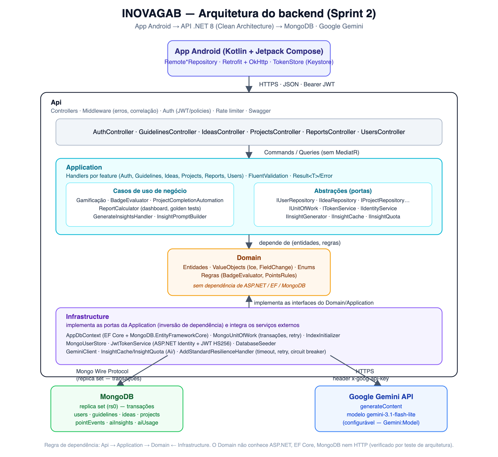

# Arquitetura do backend — INOVAGAB (Sprint 2)

*(fonte editável: [`backend-arquitetura.svg`](backend-arquitetura.svg))*

## Camadas (Clean Architecture, `Api → Application → Domain ← Infrastructure`)

| Camada | Responsabilidade | Depende de |
|---|---|---|
| **Api** | Controllers, middleware (erros, correlação, headers de segurança), autenticação JWT + policies, rate limiter, Swagger | Application |
| **Application** | Um *handler* por caso de uso (sem MediatR), agrupado por feature (Auth, Guidelines, Ideas, Projects, Reports, Users); validação (FluentValidation); `Result<T>`/`Error`; abstrações (`IUserRepository`, `IUnitOfWork`, `IInsightGenerator`…) | Domain |
| **Domain** | Entidades, *value objects* (`Ice`, `FieldChange`), enums, regras de negócio puras (`BadgeEvaluator`, `PointsRules`) | nada — sem ASP.NET, EF Core, MongoDB ou HTTP (garantido por teste de arquitetura) |
| **Infrastructure** | Implementa as abstrações da Application: EF Core + `MongoDB.EntityFrameworkCore`, `MongoUnitOfWork` (transações com retry), índices, `MongoUserStore`/JWT (ASP.NET Identity), `GeminiClient` (IA) | Application, Domain |

A App Android nunca fala direto com o Mongo ou o Gemini — só com a API, via HTTPS + JWT.

## Por que sem MediatR

Cada rota mapeia para **um** handler injetado diretamente (`IHandler<TRequest,TResponse>`, registrado por *scan* de
assembly). Menos abstração para navegar, *stack trace* direto do controller até a regra de negócio — trade-off
deliberado para um time pequeno: MediatR ajuda em bases muito grandes com muitos *pipeline behaviors*; aqui o ganho não
compensava a indireção extra.

## Persistência (MongoDB, sem migrations)

O provider EF Core para MongoDB não gerencia migrations nem índices — por isso um `IndexInitializer` roda no startup
(idempotente: nomes explícitos, mesma especificação = no-op) e cria índices únicos, parciais e TTL. Transações exigem
replica set (`rs0`, local via `docker compose` ou MongoDB Atlas M0); o `MongoUnitOfWork` repete em erro transitório
(até 8 tentativas com *jitter*) e traduz falhas do driver (`DuplicateKeyException`, `ConcurrencyConflictException`) em
vez de deixar a exceção do Mongo vazar para cima.

## Segurança

JWT HS256 (30 min) + refresh token opaco rotativo (7 dias, reuso revoga a família inteira); ASP.NET Identity com
*store* próprio (`MongoUserStore`, sem *role store* — o papel é um campo); *policies* por perfil
(`GestorOnly`/`LiderOnly`/`CanCreateIdea`/`ProjectsRead`/`UsersRead`); *rate limiting* por IP em `/auth/*` e por
usuário em `/reports/insights`; CORS restrito a origens configuradas; HSTS em produção; segredos só por variável de
ambiente (nunca no código ou nos logs).

## Integração com IA

Ver [`ia-insights.md`](ia-insights.md) para o detalhe completo (modelo, guardrails de privacidade, cache, cota e um
exemplo real de resposta).

## Migração de dados

A ferramenta `FirestoreMigrator` (`backend/tools/`) lê do Firestore (Sprint 1), remapeia todos os `_id` para
`ObjectId` do Mongo e recalcula pontos/badges pelo mesmo avaliador do servidor — ver `backend/tools/README.md`.

## Referências

- Especificação completa dos endpoints: [`docs/api/ENDPOINTS.md`](../api/ENDPOINTS.md)
- Requisitos: `.specs/features/sprint2/spec.md`
- Decisões de design detalhadas: `.specs/features/sprint2/design.md`
- README de execução: `backend/README.md`
